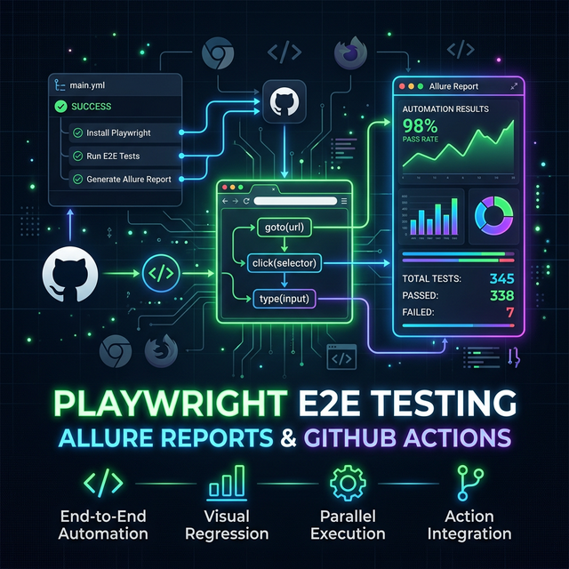

<p align="center">
  
</p>

# playwright-ci-allure

<p align="center">
  
  
  
  
</p>

[](https://jay-yeluru.github.io/playwright-ci-allure/)

> A modern, scalable sample Playwright E2E test project demonstrating beautiful reporting and clean architecture! ✨

### 🌟 Key Features

- 🏗️ **Page Object Model (POM)** for clean page abstractions
- 🎭 **Fake BDD style** — Gherkin-like `Given/When/Then` steps via Allure annotations (no Cucumber dependency)
- 📊 **Allure Reporting** with categories, history, and environment info
- ⚙️ **GitHub Actions CI** with test sharding and auto-publish to GitHub Pages

---

## 📁 Project Structure

```
playwright-ci-allure/
├── pages/
│   ├── BasePage.ts               # Abstract base for all page objects
│   └── TodoPage.ts               # Page object for the TodoMVC app
├── fixtures/
│   └── index.ts                  # Custom test fixtures (pre-built POM instances)
├── helpers/
│   ├── bdd.ts                    # Given/When/Then BDD-style step wrappers
│   ├── tags.ts                   # Typed Tag / Feature / Story / Severity / Owner enums
│   └── spec.ts                   # specMeta() — applies all Allure metadata in one call
├── scripts/
│   └── cleanup-reports.ts        # Prunes old gh-pages report runs
├── tests/e2e/
│   ├── todo-creation.spec.ts     # grouped: @smoke / @edge-case
│   ├── todo-management.spec.ts   # grouped: @smoke / @regression
│   └── todo-filtering.spec.ts    # grouped: @smoke / @regression
├── .github/workflows/
│   ├── playwright.yml            # Test + publish pipeline (9 parallel jobs)
│   └── cleanup-gh-pages.yml      # Scheduled weekly cleanup of old reports
├── playwright.config.ts
├── tsconfig.json
└── package.json
```

---

## 🚀 Getting Started

### Install

```bash
npm install
npx playwright install --with-deps
```

### Run Tests

```bash
# All tests (headless)
npm test

# With browser UI
npm run test:headed

# Debug mode
npm run test:debug

# CI mode (outputs allure-results/)
npm run test:ci
```

### View Allure Report

You need [Allure CLI](https://docs.qameta.io/allure/#_installing_a_commandline) installed:

```bash
# macOS
brew install allure

# Or via npm
npm install -g allure-commandline
```

Then:

```bash
# Generate + open in one command
npm run report

# Or step by step
npm run allure:generate   # builds allure-report/
npm run allure:open       # opens in browser

# Live serve from raw results
npm run allure:serve
```

---

## 🎭 BDD Style

Tests use a **fake BDD** approach — no Cucumber/Gherkin files required. Steps are plain TypeScript functions that wrap Allure's step annotation:

```ts
import { given, when, then, and } from '../../helpers/bdd';

test('should add a todo', async ({ todoPage }) => {
  await feature('Todo Management');
  await story('Create Todo');
  await severity('critical');

  await given('the user is on the homepage', async () => {
    await expect(todoPage.newTodoInput).toBeVisible();
  });

  await when('the user adds a task', async () => {
    await todoPage.addTodo('Buy groceries');
  });

  await then('the task should appear in the list', async () => {
    await todoPage.assertTodoVisible('Buy groceries');
  });
});
```

Steps appear nested and labelled in the Allure report UI.

---

## ⚙️ CI / GitHub Actions

### 🔄 Workflows

**`playwright.yml`** — the main pipeline, triggered on push to `main`/`develop`, PRs, nightly schedule, and manual dispatch.

It runs as 3 jobs:

**Job 1 — `test`**: 9 parallel runners (3 engines × 3 shards). Each installs only its own engine binary.

**Job 2 — `publish-report`** *(main branch only)*:
1. Downloads and merges all 9 shard result artifacts
2. Restores Allure history from `gh-pages` so trend graphs accumulate across runs
3. Generates the full Allure report with `allure generate`
4. Copies the report into `gh-pages/<run_number>/`
5. Updates `gh-pages/index.html` to always point to the latest run
6. Generates an SVG status badge at `gh-pages/badges/tests.svg`
7. Runs the cleanup script (≤ 40 runs, ≤ 30 days)
8. Commits and pushes everything back to `gh-pages`
9. Writes a summary with live URLs to the GitHub Actions job summary

**Job 3 — `pr-report-artifact`** *(PRs only)*: generates the report and uploads it as a downloadable artifact — no Pages publish so PR runs never pollute the hosted history.

---

### 🌐 One-time GitHub Pages setup

1. Go to **Settings → Pages** in your repository
2. Set **Source** to `Deploy from a branch`
3. Set **Branch** to `gh-pages`, folder `/` (root)
4. Save — GitHub will give you the URL: `https://jay-yeluru.github.io/playwright-ci-allure/`

The `gh-pages` branch is created automatically on the first push to `main` if it does not already exist.

After your first successful run the report will be live at:

```text
https://jay-yeluru.github.io/playwright-ci-allure/              ← always the latest run
https://jay-yeluru.github.io/playwright-ci-allure/<run_number>/ ← permanent link per run
https://jay-yeluru.github.io/playwright-ci-allure/badges/tests.svg ← embeddable status badge
```

Add the badge to your README:

```md

```

---

### 🧹 Report retention / cleanup

Old reports are pruned by `scripts/cleanup-reports.ts` on every publish, and also by the dedicated **`cleanup-gh-pages.yml`** workflow which runs every Sunday at 02:00 UTC.

The policy keeps whichever is more restrictive:

| Rule | Default | Override |
|---|---|---|
| Maximum number of runs | 40 | `--max-reports N` |
| Maximum age | 30 days | `--max-days N` |

The `history/`, `badges/`, and `index.html` at the root are never touched by cleanup — only numbered run subdirectories (`1/`, `2/`, `42/`, …) are eligible.

Run cleanup manually (dry-run first):

```bash
# See what would be deleted
npm run cleanup:dry-run -- --dir ./gh-pages

# Actually delete
npm run cleanup:reports -- --dir ./gh-pages

# Custom limits
npx ts-node scripts/cleanup-reports.ts --dir ./gh-pages --max-reports 20 --max-days 14
```

You can also trigger the cleanup workflow manually from the **Actions** tab in GitHub with custom `max_reports`, `max_days`, and a `dry_run` toggle.

---

## 🔧 Environment Variables

| Variable   | Default                                    | Description        |
|------------|--------------------------------------------|--------------------|
| `BASE_URL` | `https://demo.playwright.dev/todomvc`      | Target app URL     |
| `CI`       | —                                          | Enables retries    |
